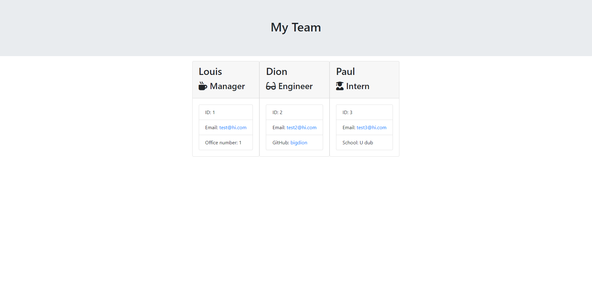

# Team-Generator

## Description
This project is to make a comprehensive README for repositorys on GitHub

---

## Table of Contents
*[Description](#description)

*[Installation](#installation)

*[GitHub](#github)

---

## Installation
The user will need to init and install inquirer to use this generator

---

## Usage for My Project
The use of this project is to make it fast and easy for users to create team profile.

---

## Contributors and Help
Louis Coleman

---

## Tests
I ran the tests given to me

---

## GitHub

https://github.com/coleloui

No user email

---
                    
                    